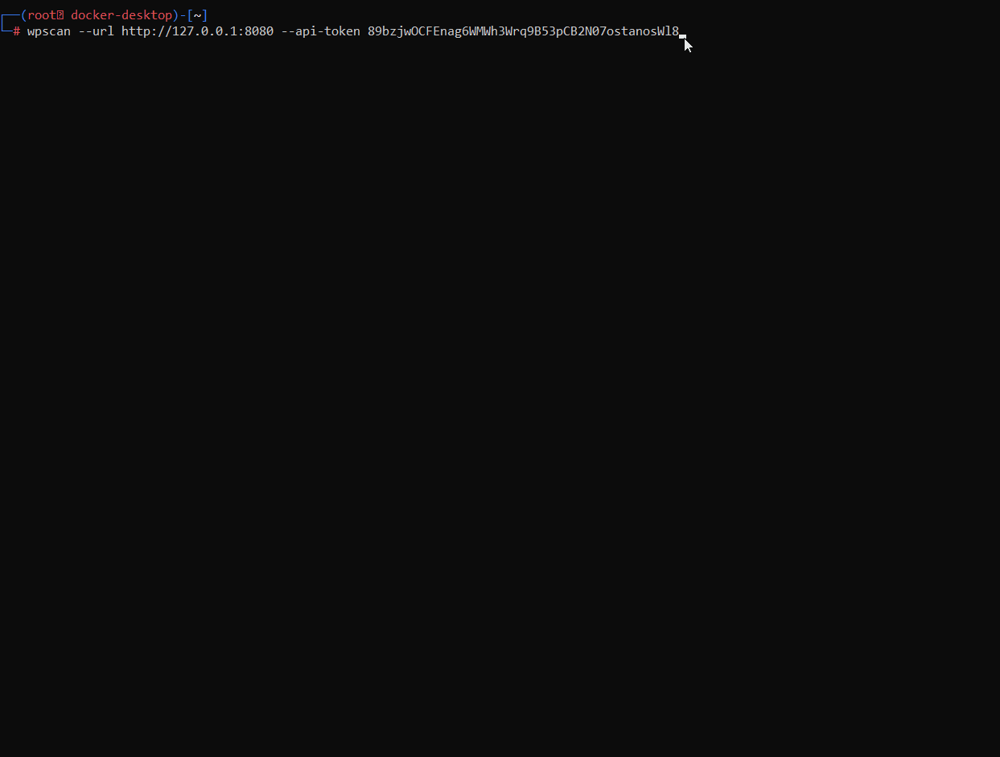
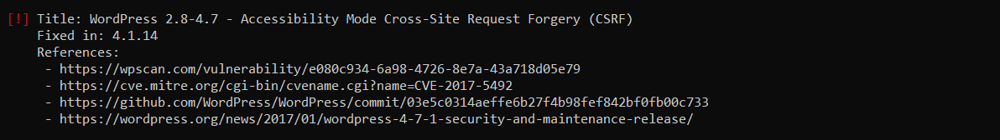
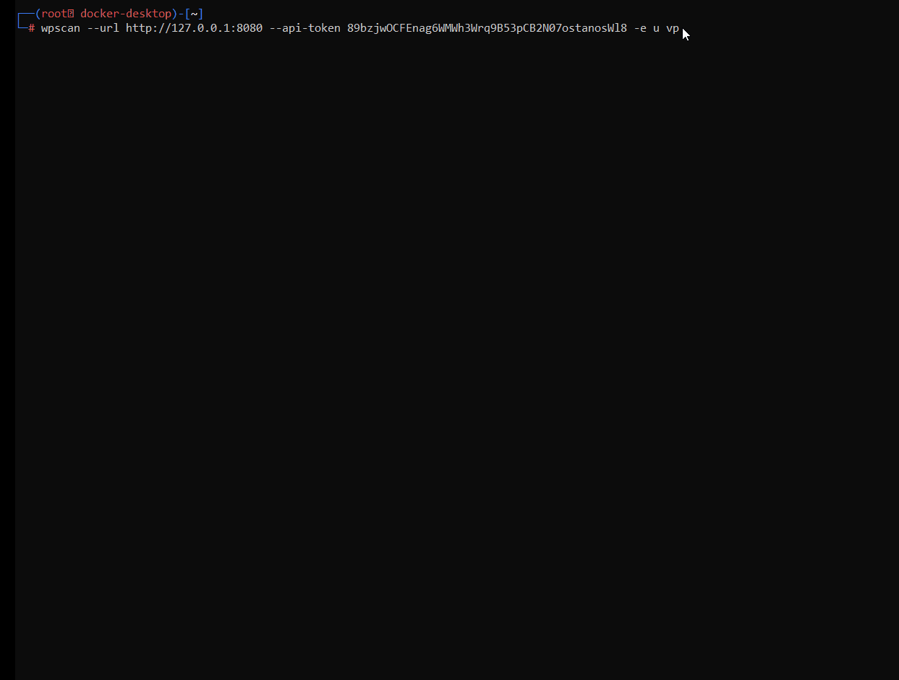
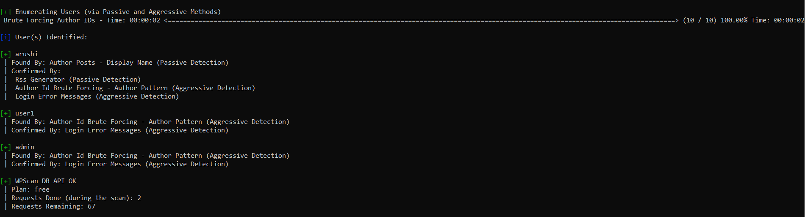
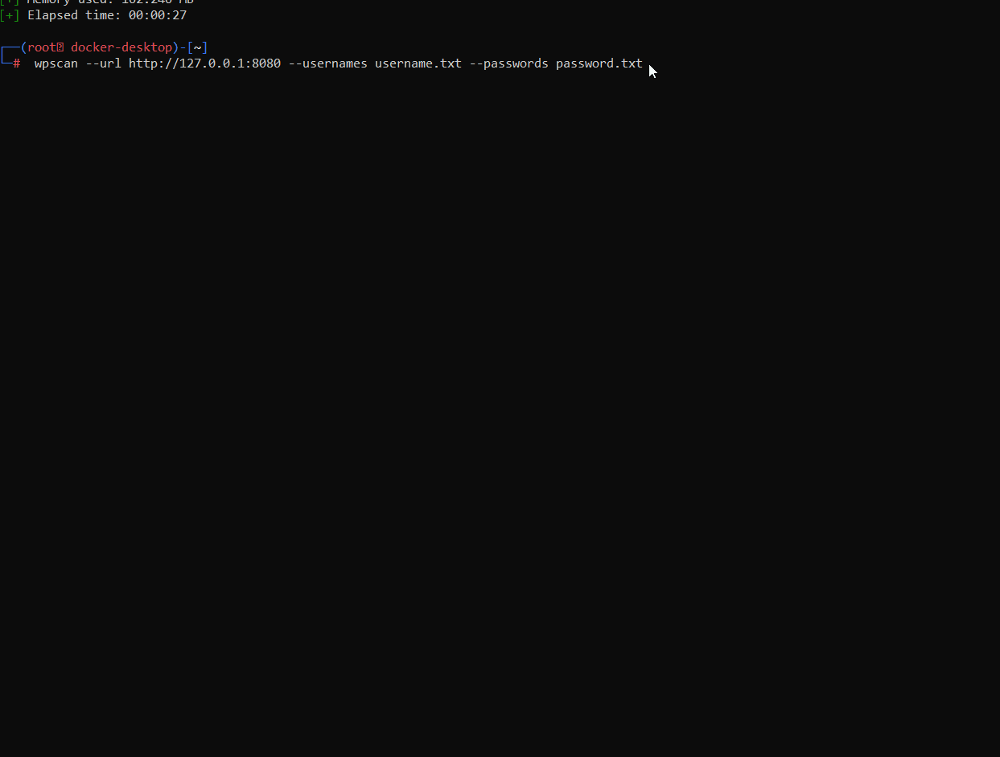
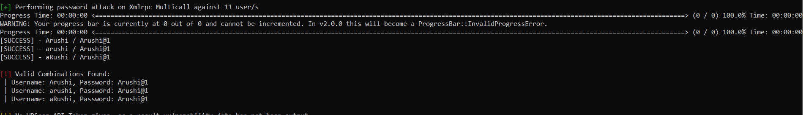

# Project 7 - WordPress Pen Testing

Time spent: 4 hours spent in total

> Objective: Find, analyze, recreate, and document three vulnerabilities affecting an old version of WordPress

## Pen Testing Report

### 1. Cross-Site Request Forgery (CSRF):-

  - This type of attack forces an end user to execute unwanted actions on a web application in which they’re currently authenticated.
  - Tested in version: 2.8 - 4.7
  - Fixed in version: 4.1.14
  
- GIF Walkthrough: 

- Image:-

- Command used to find the exploit:- wpscan --url http://127.0.0.1:8080 --api-token (your api token)
  
### 2. Username Enumeration

  - This is a common vulnerability which occurs when an attacker can determine if usernames are valid or not.
  
- GIF Walkthrough:

- Image:- 

- Command used to find the exploit:- wpscan --url http://127.0.0.1:8080 --api-token YOUR_TOKEN -e u vp
- Affected source code: http://127.0.0.1:8080/wp-login.php

### 3. Password enumeration

  -This is a common vulnerability which occurs when an attacker can determine if usernames are valid or not.
  
- GIF Walkthrough: 

- Image:

- Command used to find the exploit:-  wpscan --url http://127.0.0.1:8080 --usernames username.txt --passwords password.txt
- Create a list of usernames and passwords and store as username.txt and password.txt respectively
- Affected source code: http://127.0.0.1:8080/wp-login.php

## Resources

- [WordPress Source Browser](https://core.trac.wordpress.org/browser/)
- [WordPress Developer Reference](https://developer.wordpress.org/reference/)

GIFs created with  ...
[ScreenToGif](https://www.screentogif.com/) 

## License

    Copyright 2022 Arushi

    Licensed under the Apache License, Version 2.0 (the "License");
    you may not use this file except in compliance with the License.
    You may obtain a copy of the License at

        http://www.apache.org/licenses/LICENSE-2.0

    Unless required by applicable law or agreed to in writing, software
    distributed under the License is distributed on an "AS IS" BASIS,
    WITHOUT WARRANTIES OR CONDITIONS OF ANY KIND, either express or implied.
    See the License for the specific language governing permissions and
    limitations under the License.
